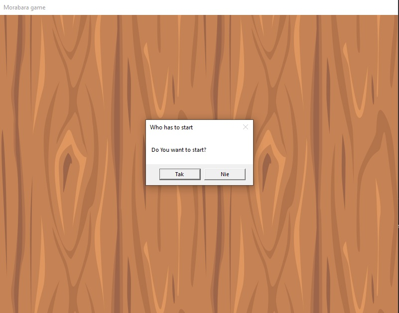
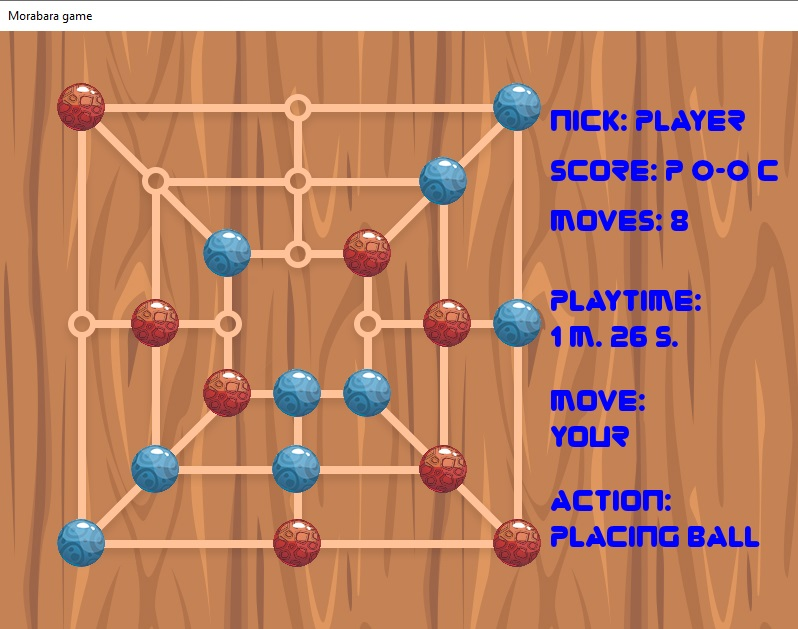
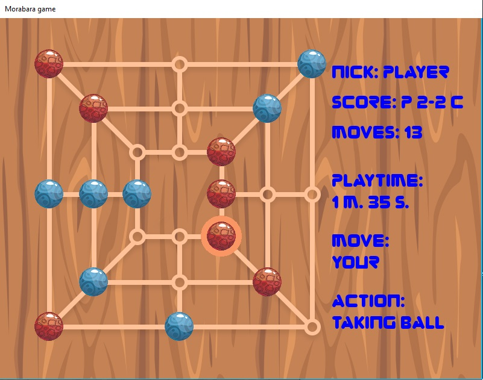
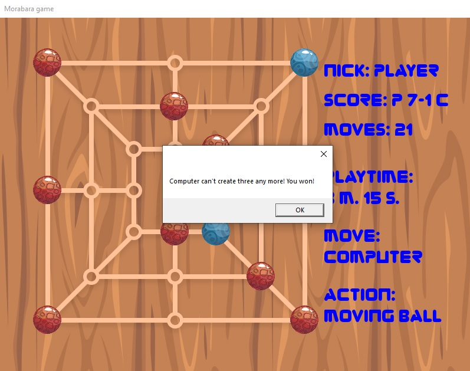
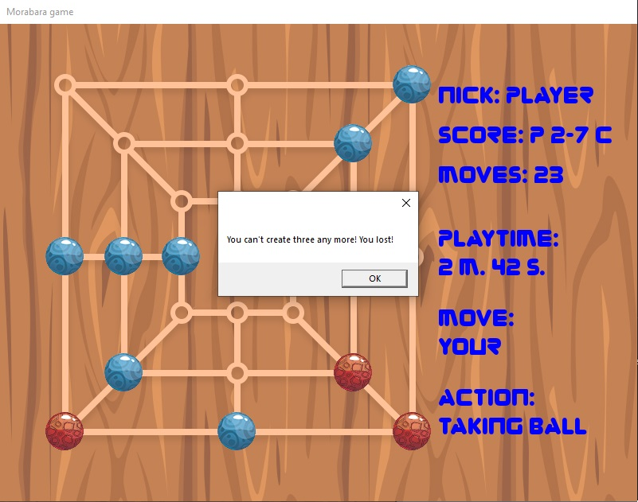

# Morabarabara

Implementation of Morabara game with AI.

## ENG

### Game

Morabaraba is a traditional two-player strategy board game played in South Africa, Botswana and Lesotho.

### Rules

The game consists in arranging 3 pieces in a row. Each time they are placed, it is possible to take one piece from the opponent. After all pieces have been placed, players move them around the board, still trying to make 3 in a row. The player with two pawns or the inability to make a move loses.
See more at https://en.wikipedia.org/wiki/Morabaraba.

### About app

The AI algorithm, which is responsible for the opponent's movements, implements the decision tree. The logic was written in C# using the SFML library. The graphics were created by https://github.com/ziomss. The project was made for the university subject "Artificial Intelligence".

## PL

### Gra

Morabaraba to tradycyjna planszowa gra strategiczna dla dwóch graczy, w którą gra się w RPA, Botswanie i Lesotho.

### Zasady

Rozgrywka polega na układaniu 3 pionów w rzędzie. Po każdorazowym ich ułożeniu możliwe jest zabranie jednego pionu przeciwnikowi. Po rozłożeniu wszystkich pionów gracze przesuwają je po planszy, dalej starając się utworzyć 3 w rzędzie. Przegrywa gracz, któremu pozostaną dwa piony lub brak możliwości wykonania ruchu.
Więcej informacji znajdziesz na https://en.wikipedia.org/wiki/Morabaraba.

### O aplikacji

Za ruchy przeciwnika odpowiada algorytm SI implementujący drzewo decyzyjne. Logika napisana została w języku C# z użyciem biblioteki SFML. Grafiki zostały stworzone przez https://github.com/ziomss. Projekt został wykonany na zaliczenie uczelnianego przedmiotu "Sztuczna inteligencja".

## Screenshots

### Menu

### Game - select who starts

### Game - placing balls

### Game - moving balls

### Game - you won

### Game - you lost
